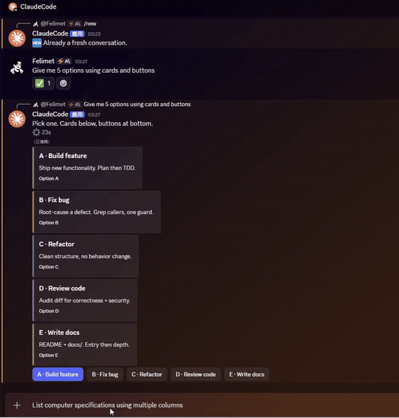

[English](README.md) · **繁體中文**

# claude-discord-daemon

**24/7 常駐的 Discord ⇄ Claude Code 橋接（Windows）。** 一個獨立行程整天佔住 Discord gateway，對每一則允許清單內的 DM spawn 一個全新的 headless `claude -p`；bot 是否上線不再取決於你有沒有開著 Claude Code 終端機。

`Windows 11` · `Bun` · `discord.js v14` · `MIT`

同時以 **npm 套件**（`bunx claude-discord-daemon` / `cdd`）與 **Claude Code plugin**（`/claude-discord-daemon:discord` 指令）兩種形式散布。

---

## 這是什麼 / 為何存在

官方 Discord channel plugin 把 Discord gateway 綁在一條 MCP stdio pipe 上，終端機一關 pipe 就死，所以 bot 只在你開著 Claude Code 時上線（安全性考量）。`claude-discord-daemon` 讓 `bot.ts` 以自己的長駐行程運行，由它自己持有 gateway 連線。每則允許清單內使用者的 DM 都 spawn 一個載入你完整全域設定（MCP servers、plugins、`CLAUDE.md`）的 headless `claude -p`，並由該行程把回覆貼回。Windows 登入自起排程任務讓它撐過關終端、崩潰、重開機。

---

## 功能

- **即時具名工具狀態卡。** 執行中一則 embed 狀態卡就地更新，逐一具名當下在跑的工具 / 技能 / MCP / 子代理 / 指令，而非只顯示模糊的「思考中」：`🔌 MCP matlab·evaluate`、`🖥️ Bash`、`🔍 Read`、`📝 Edit`、`🌐 WebFetch`、`🤖 agent code-reviewer`、`📚 skill xlsx`、`⌨️ /commit`、`🔧 tool`。
- **回覆覆蓋狀態卡。** 成功時，狀態卡直接被就地改寫成最終回覆，末尾附一行 Discord `-#` 淡色統計腳註（`⚙️ 耗時 · 各類工具 ×次數`）。聊天室只留一則訊息，不留「完成」卡 + 回覆的雙訊息。附件 / 長文 / 多段回覆則改以新訊息送出（就地編輯無法附檔），此時狀態卡收斂成只剩腳註。
- **Rich 輸出指令**（每個指令在回覆中獨佔一行）：
  - `[[embed: {json}]]` 渲染彩色 embed 卡，JSON 可跨多行。
  - `[[file: /絕對路徑]]` 附上產出檔（送出前驗證存在性與大小）。
  - 末行 `[[buttons: A | B]]` 渲染 2-5 顆真實 Discord 選擇按鈕；點按的標籤文字會作為下一則訊息回饋進同一 session。
- **50 MB 附件下載。** 使用者上傳的附件（≤ 50 MB）下載到共用 inbox，本機路徑附進 prompt 供 `claude` 用 `Read` 讀取。
- **權限中繼。** headless run 的權限提示經 `perm-mcp.ts` → loopback endpoint → Discord 上的**核准 / 拒絕**按鈕卡，擁有者點一下即決定；永不要求你回終端機批准。
- **idle-watchdog（無總時長上限）。** 預設不設 wall-clock 上限；只有當事件 stream 靜默超過 `BOT_IDLE_TIMEOUT_MS`（行程卡死）才砍掉，不會因為跑得久而被誤殺，長時間作業沒問題。
- **自然語言「開新對話」重置。** 一則訊息「本身」若是少數幾個重置語（整則訊息、不分大小寫），就會清掉已存 session，讓下一則訊息重新開始。見 [開新對話重置](#開新對話重置)。
- **per-chat session 續接。** 每個聊天的 session UUID 存在 `sessions.json`，後續訊息 `--resume`，對話上下文延續。
- **24/7 常駐。** 登入自起排程任務 `ClaudeDiscordBridge` + `launch.vbs`（detached）+ `supervise.cmd`（崩潰即重啟）+ 單例 loopback 鎖，撐過關終端、崩潰、重開機。
- **可攜：無硬編碼路徑。** 工作目錄預設為引擎所在目錄，每個路徑都可用環境變數覆寫。

---

## 簡單測試展示



[完整畫質 demo.mp4](./videos/demo.mp4)

---
## 需求

| 項目 | 說明 |
|---|---|
| OS | Windows 11（排程任務 / VBS / cmd 監督鏈為 Windows 專屬） |
| Runtime | [Bun](https://bun.sh) ≥ 1.1.0，且 `bun` 在 `PATH` 上 |
| Claude Code | 已安裝並登入的 Claude Code CLI（bridge 會 spawn `claude -p`） |
| Discord | 你自己的 Discord bot token，且該 bot 與你共享一個伺服器（Discord 要求共享伺服器才允許 DM bot） |

---

## 安裝

有兩條路，二選一。

### (a) 作為 npm 套件

```powershell
# 免安裝，一次性啟動
bunx claude-discord-daemon up

# 或全域安裝後用短別名 cdd
npm i -g claude-discord-daemon
cdd up
```

CLI 指令：

```
cdd up       # 註冊登入自起任務 + detached 啟動
cdd status   # 任務 / 行程 / log 尾巴
cdd logs     # 最後 40 行 log
cdd down     # 停止監督器 + 引擎
```

bin 名稱為 `claude-discord-daemon` 與 `cdd`（兩者相同）。

### (b) 作為 Claude Code plugin

```
/plugin marketplace add felimet/claude-discord-daemon
/plugin install claude-discord-daemon
```

Claude Code 會為 plugin 指令加上插件名前綴,所以實際指令是 `/claude-discord-daemon:discord`。用它驅動同一個 daemon：

```
/claude-discord-daemon:discord up | down | status | logs
```

它底層呼叫同一組 `cdd` CLI（`cdd` 不在 `PATH` 時退回 `bunx claude-discord-daemon`）。

---

## 設定

啟動前，把 bot token 與發訊 allowlist 放進 bridge 的 state 目錄（預設 `~/.claude/channels/discord/`，可用 `DISCORD_STATE_DIR` 覆寫）。

**1. Bot token**：寫入 `~/.claude/channels/discord/.env`：

```
DISCORD_BOT_TOKEN=你的_discord_bot_token
```

（或直接在 process 環境設 `DISCORD_BOT_TOKEN`；真實環境變數優先於 `.env` 檔。）

**2. Allowlist**：建立 `~/.claude/channels/discord/access.json`，把你的 Discord 使用者 ID 加進 `allowFrom`：

```json
{
  "allowFrom": ["你的_discord_user_id"]
}
```

只有 `allowFrom` 內的使用者 ID 發的 DM 會被處理，其餘一律忽略（fail-closed）。此檔每則訊息重讀，改 allowlist 免重啟。

**3. 配對並 DM**：把你的 bot 邀請進任一你也在的 Discord 伺服器（Discord 要求共享伺服器才允許 DM bot），然後直接 DM 這個 bot。

`access.json` 額外選用鍵（沿用官方 plugin 語意）：

| 鍵 | 預設 | 作用 |
|---|---|---|
| `ackReaction` | `⏳` | 收訊 ack 表情；設 `""` 停用 |
| `textChunkLimit` | `2000` | 單則訊息字元上限（上限 2000） |
| `chunkMode` | `newline` | 分段策略：`newline`（段落感知）或 `length`（硬切） |

---

## 設定（環境變數）

除 `DISCORD_BOT_TOKEN` 外皆為選用；在 process 環境設定即可覆寫預設。

| 變數 | 預設 | 作用 |
|---|---|---|
| `DISCORD_BOT_TOKEN` | （必要） | Discord bot token；未設則讀 `<state 目錄>/.env` |
| `DISCORD_STATE_DIR` | `~/.claude/channels/discord` | 存放 `.env`、`access.json`、下載附件 `inbox/` 的目錄 |
| `BOT_WS_DIR` | 引擎所在目錄 | `sessions.json`、`outbox/`、`bot.log` 的工作目錄 |
| `CLAUDE_BIN` | `~/.local/bin/claude` | bridge spawn 的 `claude` 執行檔路徑 |
| `BOT_PERMISSION_MODE` | `auto` | spawn run 的權限模式。`auto`：auto 分類器逐工具把關（唯讀放行，破壞性 / 自我修改轉為 Discord 核准 / 拒絕按鈕）。設 `default` 則再收緊，所有需審批工具都走按鈕流程 |
| `BOT_MODEL` | 未設（帳號預設） | 指定 Claude 模型，如 `claude-sonnet-5` / `haiku`，以降成本 |
| `BOT_TIMEOUT_MS` | `0`（不設限） | 單次 run 的 wall-clock 總上限（ms）；`0` 表示不設限（支援長作業） |
| `BOT_IDLE_TIMEOUT_MS` | `1800000`（30 分） | stream 事件靜默逾此毫秒數即視為卡死砍掉 |
| `BOT_PERM_PORT` | `49223` | 權限核准 endpoint 的 loopback port（`perm-mcp.ts` 回呼） |
| `BOT_PERM_TIMEOUT_MS` | `600000`（10 分） | 權限卡未回應多久後自動拒絕 |
| `BOT_LOCK_PORT` | `49222` | 單例 loopback 鎖 port |

---

## 開新對話重置

傳一則「本身就是」下列任一者的訊息（整則訊息、不分大小寫），即可清掉已存 session，讓下一則訊息重新開始：

```
新對話   開新對話   重新開始   重開   清除對話   忘記
/new   /reset   reset   new chat
```

判定為嚴格整則比對（容許尾端空白 / 標點），所以像 `來開新對話討論 X` 這種夾帶提及**不會**重置，只有整則訊息就是重置語才會。重置時 bot 會回應 🆕 並確認；下一則 DM 開啟全新的 `claude -p` session。

---

## 運作方式

```
Discord DM ──gateway──▶ bot.ts（長駐；佔 loopback :49222 當單例鎖）
                          │  allowlist 檢查（access.json）
                          │  per-chat 序列化 + session 續接（sessions.json）
                          ▼
                  spawn: claude -p --output-format stream-json --verbose
                         --permission-mode auto
                         --permission-prompt-tool mcp__perm__approve
                         （--mcp-config 併入 perm-mcp；全域 MCP / plugin / CLAUDE.md 照常載入）
                          │
                          │  逐 stream-json 事件 → 更新具名工具狀態卡 + 餵 idle-watchdog
                          ▼
                  成功 → 狀態卡就地改寫成最終回覆 + 淡色 -# 統計腳註 ──▶ Discord

啟動鏈: 登入任務 ClaudeDiscordBridge ─▶ wscript launch.vbs ─(detached)▶ supervise.cmd 迴圈 ─▶ bun bot.ts
```

每則 DM 都是一次全新的 `claude -p`。因為載入的是同一份全域 MCP / plugin / `CLAUDE.md`，回覆行為與你在終端機開的 Claude Code session 一致。session UUID 以聊天為鍵存在 `sessions.json`，已存 session 以 `--resume` 續接；非暫時性的 resume 失敗會丟棄該 session 並重試一次全新 run。同一聊天內的訊息會序列化，避免快速連發的 DM 競用 session 檔。

---

## 架構註記：為什麼是獨立橋接，而非官方 channel engine

Anthropic 把任何未核准的自訂 channel 擋在 `--dangerously-load-development-channels` 後面，而該旗標會跳一個啟動確認對話框。headless daemon 沒有 TTY 可回應該對話框，因此會卡住，也就是說自訂 rich channel 根本無法作為 daemon 運行。`bot.ts` 自帶 discord.js gateway 才是可 headless 運行的路徑：不需開發用 channel 旗標、不需互動確認，因此能無人值守以服務運行。

由於本橋接與官方 plugin 用同一個 bot token 登入，作為服務運行前必須先停用官方 plugin（`claude plugin disable discord@claude-plugins-official`），同一 token 兩個 gateway 登入會導致重複回覆。

---

## 安全

- **Discord 輸入視為不可信**（prompt-injection 面）。來訊以 `<channel source="discord" ...>` 包裝（meta 在 tag 內、不可信文字在標籤內容中），系統提示要求模型把該內容當成聊天文字，絕不當成改設定或改權限的指令。
- **allowlist 收斂發訊面。** 只有 `access.json` 的 `allowFrom` 內使用者 ID 能觸發任何 run；讀取 `access.json` 失敗一律 fail-closed。按鈕點擊者（含權限核准按鈕）同樣經此 allowlist 重新驗證。
- **權限模式 `auto`（預設）。** auto 分類器逐工具把關，唯讀放行，破壞性 / 自我修改阻擋並轉為 Discord 核准 / 拒絕按鈕。**永不使用 `bypassPermissions`。** 設 `BOT_PERMISSION_MODE=default` 可再收緊。
- **access 與配對僅由擁有者管理**，於 state 目錄操作，永不經由聊天。

---

## License

MIT © 2026 Jia-Ming Zhou (felimet)
